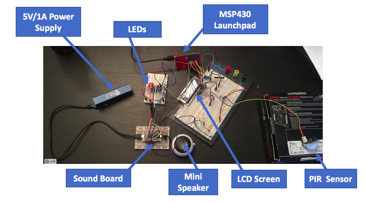

# Lazy Man's Radio

You’ve just come home from your 12 hour shift at Kemere Labs. It's time to lay back and destress with some of your favorite tunes. To your dismay, you find that changing songs requires an inordinate amount of effort. Who has time to reach over for the darned skip button every time she wants to move on to the next song?

That’s where we come in!

Presenting, the lazy man’s radio. An inexpensive and modern alternative to today’s music players. Simply wave your hand in front of the sensor to trigger a “skip” to the next song! Our music player features all the standard capabilities of its contemporaries for a fraction of the price.

### [Demo Video](https://www.youtube.com/watch?v=JdD40mU05lw)

### [Code](https://github.com/sujayt123/lazy-radio-station)

### Features

* An LCD screen to display information about the current track
* A PIR sensor to detect motion and subsequently trigger the next track
* A pushbutton that also allows you to cycle through tracks
* A pretty LED array to further indicate which track is on
* A shift register to configure the means of flipping tracks
  * Modify and reprogram the system to skip one, two or more tracks per motion
  * Reorder the order in which to visit songs on the soundboard
* A (customizable) soundboard pre-loaded with eight of today's most popular hits


### Partslist

 * [16x2 HD44780 LCD Screen](https://www.adafruit.com/product/181) to display track info
 * [74HC595 Shift Register](http://www.ti.com/lit/ds/symlink/sn74hc595.pdf) to serve as a 1-cold decoder
 * [Pushbutton](https://www.sparkfun.com/products/97) for track cycling
 * [Audio FX Soundboard](https://www.adafruit.com/product/2220) to store the uncompressed audio files
 * [TI-MSP430G2553 Launchpad](http://www.ti.com/tool/MSP-EXP430G2) to program, control and power the embedded system
 * [PIR Sensor](https://www.adafruit.com/product/189) for motion detection
 * [5V/1A USB power supply](https://www.amazon.com/Jackery-Premium-3350mAh-Portable-Charger/dp/B00L9F95RO/ref=zg_bs_7073960011_15?_encoding=UTF8&psc=1&refRID=KQ9980D06M4S5FD3NESW) to power the speaker and soundboard
 * [Speaker](https://www.sparkfun.com/products/14023) to emit the audio output of the system

### Schematic

### Circuit 


### Architecture
##### Hardware
After carefully taking into consideration the limitations of the MSP430 microcontroller, our group began to discuss which parts we would incorporate into our project. We knew that at the very least, we'd need the following:
* a way to interface with the soundboard
* a way to interface with the LCD
* a way to interface with a motion sensor

We'll discuss each of these in detail, from initial conception to final execution.
###### Soundboard 
We purchased Adafruit's Audio FX soundboard because of its low cost and simplicity. The ability to customize song choices and trigger modes of the soundboard was the deciding factor in the purchase.

The soundboard has up to 11 pins (with built-in pull-up resistors) that can be driven low to play the corresponding song mapped to that pin. The song mapping is specified by the consumer via the particular naming scheme of the songs on the filesystem of the soundboard. 

Pretty easy, right? All you have to do to trigger a song to play is to drive the input into some pin low. For the embedded systems programmer, however, this mechanism seems rather insidious - at first glance, it necessitates the usage of 11 MSP430 GPIO pins to drive the soundboard. Thankfully, this difficulty can be circumvented with some shrewdness. 

We initially decided to use 1-cold decoder to allow a system of up to 16 pins to be controlled with only 4 GPIOs of the MSP430. However, to avoid potential timing issues with GPIO management, we ended up going with the sequential logic equivalent of the combinational 1-cold decoder: the 74HC595 shift register. With only three GPIOs of the MSP430, we could control up to eight pins of the soundboard - and potentially more, if we were willing to daisy-chain multiple 74HC595s - using the specified protocol for serial communication. Provided support for the 74HC595, which comes pre-packaged in the Energia Sidekick kit, was incredibly helpful when we were programming the MSP430.

###### LCD
We purchased a 16x2 HD44780 LCD screen from Adafruit for this project because of its popularity among hobbyists and general community support. Initially, we tried to be extremely conservative about the GPIO usage and opted to purchase an SPI/I2C backpack, a hardware controller that wraps around the LCD to give a much more convenient interface to the embedded programmer. The backpack would only require three to four pins to communicate with the LCD, as opposed to the traditional six or seven!

Unfortunately, the extant MSP430 support for the backpack was rather limited. Device drivers for the Arduino were available on Adafruit's websites, but after several hours of trying to port the provided C++ code into the MSP430-flavored C, we gave up and transitioned to the standard interface with the LCD. Thanks to the clever aspects of the rest of our design, we were able to easily support the GPIO requirements of the LCD interface.

Let's briefly outline the hardware interface of the LCD screen to learn more about the LCD screen.
* RS pin: indicates whether the byte transferred is a special command to the MPU or standard writable data
* RW pin: read/write mode. Pulled to ground to signal write-only.
* E  pin: enable pin. Starts data write.
* DB4 to DB7: one half of the byte to transfer.
* DB0 to DB3: unused in 4-bit mode. We use 4 bit mode to save GPIO pins.

The LCD expects a few initialization commands, according to pages 45 and 46 of the [HD44780 specification manual](https://www.sparkfun.com/datasheets/LCD/HD44780.pdf). Once the LCD is configured, it can process instructions in the form of bytes - transferred as two sets of 4 bits in 4-bit mode - that are decoded with respect to RS, RW and the actual value of the byte itself. We incorporated Kevin Lin's LCD device driver to communicate with the device using a more high-level software interface.

###### Motion sensor 
We initially purchased a flight-sensor to get accurate readings of detected objects in the vicinity of the sensor. With its i2c compatibility, the sensor appeared to be an easy way to detect if an object was in range to trigger the next song. However, i2c on the MSP430 proved to be insurmountably difficult given our time constraints and we turned our attention to another product: the PIR motion sensor. While the PIR was ostensibly less accurate and only relayed 1 bit of information ("Did I detect motion or not?"), it was much easier to use in conjunction with everything else in our system. By tuning its sensitivity dial, we configured it to work well in its environment.

##### Software
We incorporated open-source device drivers from TI and Kevin Lin to interface from a high-level with the shift register and MSP430, respectively. In our main program, we poll the switchbutton and PIR, cycling to the next song if the input indicates to do so. In the future, we would consider using interrupts to drive these trigger abilities, but we didn't have enough time to organize the architecture around them in time for the deadline. A snippet of the polling logic is provided below.

```c
int main(void) {
  ...
  lcd_init(0); // Initialize the LCD screen
  lcd_clear_all();
  lcd_display_string(0, descriptions[0]);

  ...

  int i = 0;
  int pirState = 0;
  shiftOut(~(1 << i)); // Play the first track

  while (1) {
    if (!(P1IN & BIT1)) // Prioritize button press over motion
    {
      shiftOut(~(1 << i)); // Trigger the current song
      lcd_clear_all();
      lcd_display_string(0, descriptions[i]); // Display the current song 
      __delay_cycles(500000); // Allow the switch to debounce
      i = (i + 1) % 8; // Identify the next song to play    
    } else if (P1IN & BIT2) // The IR sensor output is high
    {
      if (pirState == 0) // Only trigger on the "rising edge" of the output
      {
        shiftOut(~(1 << i));
        lcd_clear_all();
        lcd_display_string(0, descriptions[i]);
        __delay_cycles(500000);
        i = (i + 1) % 8;
        pirState = 1;
      }
    } else {
      pirState = 0;
    }
  }
}
```
